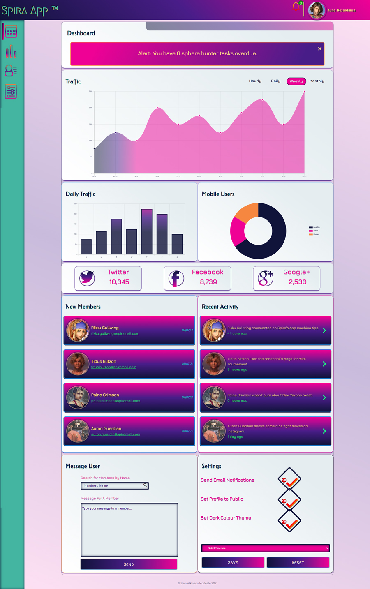

#  Team Treehouse - Project 7 - WebApp Dashboard

This is my seventh project for the [Front End Web Development Techdegree at Treehouse](https://teamtreehouse.com/techdegree/front-end-web-development) at which was tasked with creating 
### Description
This project was the creation of a dashboard that displays the traffic on social media channels and members activity.

## Table of contents
- [Overview](#overview)
  - [About this project](#about-this-project)
  - [Screenshot](#screenshot)
  - [Link](#links)
- [Process](#my-process) 
  - [Technologies used](#technologies-used) 
  - [What I learned](#what-i-learned) 
  - [Continued development](#continued-development) 
  - [Useful resources](#useful-resources) 
- [Author](#author) 
- [Acknowledgments](#acknowledgments) Coming Soon

## Overview
  
### About this project
Users should be able to:
- A mobile-first approach is utilized using min-width properties for media queries.

- Use CSS grid to lay out the main elements (header, sidebar navigation, main content) on the page.

- Includes alert banner that user can close.

- Has multiple different charts implemented with Chart.js

- Includes an alert icon in the header with a marker to notify the user of new alerts and messages.

- Added a CSS animation and notification marker on the bell icon

- **Exceeds:** Shows multiple notifications when the user clicks on the bell icon

- **Exceeds:** Traffic line chart can be updated with new data using the hourly, daily, weekly and monthly links

- **Exceeds:** Autocomplete search input field to search for members

- **Exceeds:** Local storage is used to save the settings and display those settings upon reloading the page.

### Screenshot of my project 7 desktop

### Live Link
- Live Site URL: [Project 7 WebApp Dashboard](https://samatkinsonmodeste.github.io/Treehouse-Project-7-Dashboard/)
)

## My Process

### Technoliges Used
- Semantic HTML5 markup
- Flexbox
- CSS Grid
- Mobile-first layout
- SVG Images
- JavaScript
- [Chart.js](https://www.chartjs.org/) - JS library

### What I Learned
Wow, I really learnt a lot on this project as this was the first project where you started with blank HTML, CSS and JavaScript files. This was also the first time I felt confident about my JavaScript skills.   
Including SVG files as inline and as background images in CSS was fun, enjoyable as well as an exciting topic to learn. In addition, I independently learnt to add the option of a Dark Colour Theme to my project as an option for a user.  
 I created my own Toggle buttons with original Sass.
The most challenging part was the local storage.

### Continued Development
In the future I'd like to improve this project by:

- Using JavaScript I would like to add and remove the *current class* from my nav items when they are active or inactive.

- Improve the JavaScript code I used for the Traffic Chart nav.
- Use an API to work wih dynamic data

### Resources
- [W3School Learn how to create an Autocomplete](https://www.w3schools.com/howto/howto_js_autocomplete.asp)
- [Creating a Chart](https://www.chartjs.org/docs/latest/)

## Author
- Team Treehouse - [samanthaatkinson](https://www.teamtreehouse.com/samanthaatkinson)
- Twitter - [@sammodeste1](https://www.twitter.com/@sammodeste1)
- LinkedIn - [sam-atkinson-modeste](https://www.linkedin.com/<<sam-atkinson-modeste>>)
- GitHub - [SamAtkinsonModeste](https://www.github.com/SamAtkinsonModeste)

## Acknowledgments
- [Brian Jensen](https://teamtreehouse.com/brianjensen) really knows how to support and bring out the best in a student. He always supports me even when I am going beyond the Exceed challenging requires and I am trying to do things beyond what I've been taught.😂 However, some how with his support I always achieve my goals.
